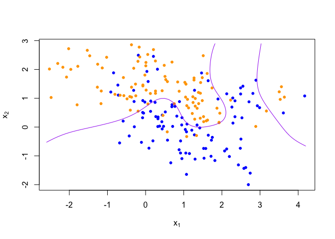
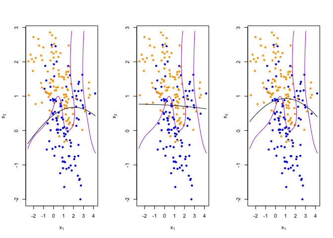
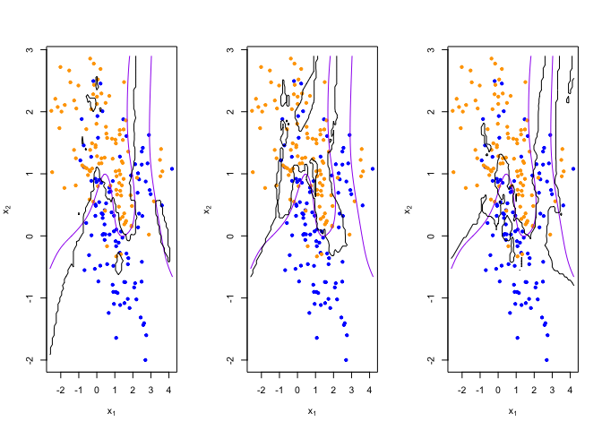

Homework 1
================
YutingMei
January 27, 2022

-   Read the help file for R’s built-in linear regression function lm

``` r
?lm
```

``` r
## load binary classification example data from author website 
## 'ElemStatLearn' package no longer available
load(url('https://web.stanford.edu/~hastie/ElemStatLearn/datasets/ESL.mixture.rda'))
dat <- ESL.mixture
```

``` r
plot_mix_data <- expression({
  plot(dat$x[,1], dat$x[,2],
       col=ifelse(dat$y==0, 'blue', 'orange'),
       pch=20,
       xlab=expression(x[1]),
       ylab=expression(x[2]))
  ## draw Bayes (True) classification boundary
  prob <- matrix(dat$prob, length(dat$px1), length(dat$px2))
  cont <- contourLines(dat$px1, dat$px2, prob, levels=0.5)
  rslt <- sapply(cont, lines, col='purple')
})

eval(plot_mix_data)
```

<!-- -->

``` r
## fit linear classifier
fit_lc <- function(y, x) {
  x <- cbind(1, x)
  beta <- drop(solve(t(x)%*%x)%*%t(x)%*%y)
}

## make predictions from linear classifier
predict_lc <- function(x, beta) {
  cbind(1, x) %*% beta
}

## fit model to mixture data and make predictions
lc_beta <- fit_lc(dat$y, dat$x)
lc_pred <- predict_lc(dat$xnew, lc_beta)

## reshape predictions as a matrix
lc_pred <- matrix(lc_pred, length(dat$px1), length(dat$px2))
contour(lc_pred,
      xlab=expression(x[1]),
      ylab=expression(x[2]))
```

<!-- -->

``` r
## find the contours in 2D space such that lc_pred == 0.5
lc_cont <- contourLines(dat$px1, dat$px2, lc_pred, levels=0.5)

## plot data and decision surface
eval(plot_mix_data)
sapply(lc_cont, lines)
```

<!-- -->

    ## [[1]]
    ## NULL

-   Re-write the functions fit\_lc and predict\_lc using lm, and the
    associated predict method for lm objects.

``` r
dn = data.frame(x1 = dat$x[,1], x2 = dat$x[,2], y = dat$y)
```

``` r
fit_m = function(data){
  lm(y ~ x1 + x2, data)
}

predict_m = function(fit){
  predict(fit, dat$xnew)
}
```

``` r
# estimated parameter:
# beta1: -0.02264, beta2: 0.24960, intercept: 0.32906
re = fit_m(dn)
summary(re)
```

    ## 
    ## Call:
    ## lm(formula = y ~ x1 + x2, data = data)
    ## 
    ## Residuals:
    ##     Min      1Q  Median      3Q     Max 
    ## -0.9558 -0.3655  0.0318  0.3737  0.7779 
    ## 
    ## Coefficients:
    ##             Estimate Std. Error t value Pr(>|t|)    
    ## (Intercept)  0.32906    0.04783   6.880 7.77e-11 ***
    ## x1          -0.02264    0.02543  -0.890    0.374    
    ## x2           0.24960    0.03215   7.764 4.38e-13 ***
    ## ---
    ## Signif. codes:  0 '***' 0.001 '**' 0.01 '*' 0.05 '.' 0.1 ' ' 1
    ## 
    ## Residual standard error: 0.4248 on 197 degrees of freedom
    ## Multiple R-squared:  0.2892, Adjusted R-squared:  0.282 
    ## F-statistic: 40.07 on 2 and 197 DF,  p-value: 2.504e-15

``` r
# make prediction from the revised function
re_p = predict_m(re)
## reshape predictions as a matrix
re_p <- matrix(re_p, length(dat$px1), length(dat$px2))
contour(re_p,
      xlab=expression(x[1]),
      ylab=expression(x[2]))
```

<!-- -->

``` r
## find the contours in 2D space such that lc_pred == 0.5
re_cont <- contourLines(dat$px1, dat$px2, re_p, levels=0.5)

## plot data and decision surface
eval(plot_mix_data)
sapply(re_cont, lines)
```

<!-- -->

    ## [[1]]
    ## NULL

-   Consider making the linear classifier more flexible, by adding
    squared terms for x1 and x2 to the linear model

``` r
fit2 = lm(y ~ x1 + x2 + I(x1^2) + I(x2^2), data = dn)
```

``` r
summary(fit2)
```

    ## 
    ## Call:
    ## lm(formula = y ~ x1 + x2 + I(x1^2) + I(x2^2), data = dn)
    ## 
    ## Residuals:
    ##      Min       1Q   Median       3Q      Max 
    ## -0.90183 -0.37872  0.05262  0.36480  0.78229 
    ## 
    ## Coefficients:
    ##             Estimate Std. Error t value Pr(>|t|)    
    ## (Intercept)  0.33924    0.05216   6.504 6.43e-10 ***
    ## x1          -0.03705    0.03380  -1.096    0.274    
    ## x2           0.26671    0.04247   6.280 2.16e-09 ***
    ## I(x1^2)      0.00734    0.01326   0.554    0.580    
    ## I(x2^2)     -0.01767    0.02339  -0.755    0.451    
    ## ---
    ## Signif. codes:  0 '***' 0.001 '**' 0.01 '*' 0.05 '.' 0.1 ' ' 1
    ## 
    ## Residual standard error: 0.4261 on 195 degrees of freedom
    ## Multiple R-squared:  0.2921, Adjusted R-squared:  0.2775 
    ## F-statistic: 20.11 on 4 and 195 DF,  p-value: 6.985e-14

``` r
# compare MSE(bias^2 + variance + irreducible error)
# the new linear model have smaller MSE
mse1 = mean(residuals(re)^2)
mse2 = mean(residuals(fit2)^2)
mse1
```

    ## [1] 0.1777066

``` r
mse2
```

    ## [1] 0.1769851

``` r
pred_new = matrix(predict(fit2, dat$xnew), length(dat$px1), length(dat$px2))
contour(pred_new,
      xlab=expression(x[1]),
      ylab=expression(x[2]))
```

<!-- -->

``` r
eval(plot_mix_data)
l = contourLines(dat$px1, dat$px2, pred_new, levels=0.5)
sapply(l, lines)
```

<!-- -->

    ## [[1]]
    ## NULL

``` r
## fit knn classifier
## use 5-NN to estimate probability of class assignment
knn_fit <- knn(train=dat$x, test=dat$xnew, cl=dat$y, k=5, prob=TRUE)
knn_pred <- attr(knn_fit, 'prob')
knn_pred <- ifelse(knn_fit == 1, knn_pred, 1-knn_pred)

## reshape predictions as a matrix
knn_pred <- matrix(knn_pred, length(dat$px1), length(dat$px2))
contour(knn_pred,
        xlab=expression(x[1]),
        ylab=expression(x[2]),
        levels=c(0.2, 0.5, 0.8))
```

<!-- -->

``` r
## find the contours in 2D space such that knn_pred == 0.5
knn_cont <- contourLines(dat$px1, dat$px2, knn_pred, levels=0.5)

## plot data and decision surface
eval(plot_mix_data)
sapply(knn_cont, lines)
```

<!-- -->

    ## [[1]]
    ## NULL
    ## 
    ## [[2]]
    ## NULL
    ## 
    ## [[3]]
    ## NULL
    ## 
    ## [[4]]
    ## NULL
    ## 
    ## [[5]]
    ## NULL

``` r
## do bootstrap to get a sense of variance in decision surface
resample <- function(dat) {
  idx <- sample(1:length(dat$y), replace = T)
  dat$y <- dat$y[idx]
  dat$x <- dat$x[idx,]
  return(dat)
}
```

``` r
## plot linear classifier for three bootstraps
par(mfrow=c(1,3))
for(b in 1:3) {
  datb <- resample(dat)
  ## fit model to mixture data and make predictions
  lc_beta <- fit_lc(datb$y, datb$x)
  lc_pred <- predict_lc(datb$xnew, lc_beta)
  
  ## reshape predictions as a matrix
  lc_pred <- matrix(lc_pred, length(datb$px1), length(datb$px2))

  ## find the contours in 2D space such that lc_pred == 0.5
  lc_cont <- contourLines(datb$px1, datb$px2, lc_pred, levels=0.5)
  
  ## plot data and decision surface
  eval(plot_mix_data)
  sapply(lc_cont, lines)
}
```

<!-- --> \*
Describe how this more flexible model affects the bias-variance tradeoff
<br> - From the figure below, the variance of new model become larger,
the bias become smaller

``` r
## plot the new linear classifier for three bootstraps
par(mfrow=c(1,3))
for(b in 1:3) {
  datb <- resample(dat)
  dn = data.frame(x1 = datb$x[,1], x2 = datb$x[,2], y = datb$y)
  fitn = lm(y ~ x1 + x2 + I(x1^2) + I(x2^2), data = dn)
  ## fit model to mixture data and make predictions
  pred_new = matrix(predict(fitn, dat$xnew), length(dat$px1), length(dat$px2))

  ## find the contours in 2D space such that lc_pred == 0.5
  lc <- contourLines(datb$px1, datb$px2, pred_new, levels=0.5)
  
  ## plot data and decision surface
  eval(plot_mix_data)
  sapply(lc, lines)
}
```

<!-- -->

``` r
## plot 5-NN classifier for three bootstraps
par(mfrow=c(1,3))
for(b in 1:3) {
  datb <- resample(dat)
  
  knn_fit <- knn(train=datb$x, test=datb$xnew, cl=datb$y, k=5, prob=TRUE)
  knn_pred <- attr(knn_fit, 'prob')
  knn_pred <- ifelse(knn_fit == 1, knn_pred, 1-knn_pred)
  
  ## reshape predictions as a matrix
  knn_pred <- matrix(knn_pred, length(datb$px1), length(datb$px2))

  ## find the contours in 2D space such that knn_pred == 0.5
  knn_cont <- contourLines(datb$px1, datb$px2, knn_pred, levels=0.5)
  
  ## plot data and decision surface
  eval(plot_mix_data)
  sapply(knn_cont, lines)
}
```

<!-- -->

``` r
## plot 20-NN classifier for three bootstraps
par(mfrow=c(1,3))
for(b in 1:3) {
  datb <- resample(dat)
  
  knn_fit <- knn(train=datb$x, test=datb$xnew, cl=datb$y, k=20, prob=TRUE)
  knn_pred <- attr(knn_fit, 'prob')
  knn_pred <- ifelse(knn_fit == 1, knn_pred, 1-knn_pred)
  
  ## reshape predictions as a matrix
  knn_pred <- matrix(knn_pred, length(datb$px1), length(datb$px2))
  
  ## find the contours in 2D space such that knn_pred == 0.5
  knn_cont <- contourLines(datb$px1, datb$px2, knn_pred, levels=0.5)
  
  ## plot data and decision surface
  eval(plot_mix_data)
  sapply(knn_cont, lines)
}
```

<!-- -->
