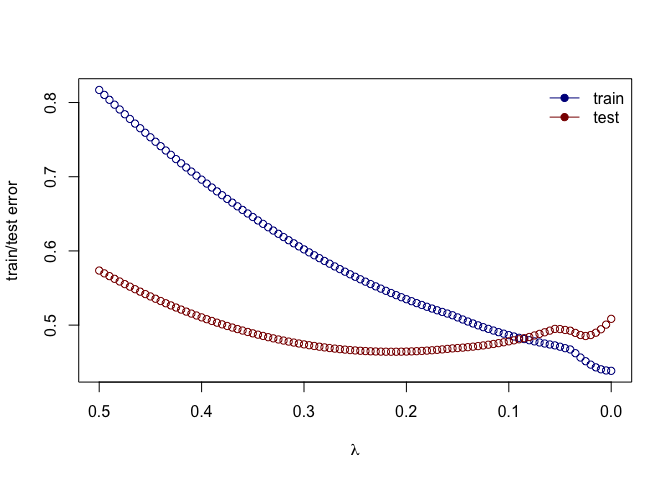
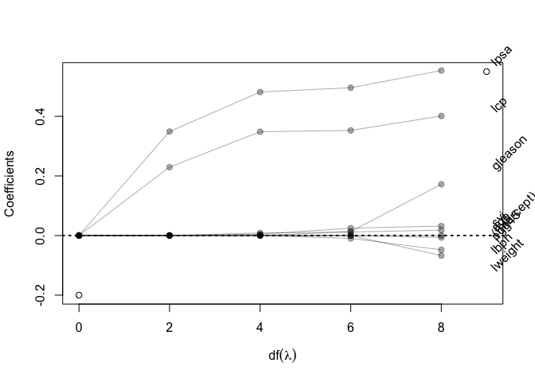

Homework 3
================
YutingMei
February 13, 2022

-   Use the prostate cancer data.

``` r
## load prostate data
prostate <- 
  read.table(url(
    'https://web.stanford.edu/~hastie/ElemStatLearn/datasets/prostate.data'))
```

``` r
## subset to training examples
prostate_train <- subset(prostate, train==TRUE)
```

``` r
## plot lcavol vs lpsa
plot_psa_data <- function(dat=prostate_train) {
  plot(dat$lpsa, dat$lcavol,
       xlab="log Prostate Screening Antigen (psa)",
       ylab="log Cancer Volume (lcavol)",
       pch = 20)
}
plot_psa_data()
```

<!-- -->

-   Use the cor function to reproduce the correlations listed in HTF
    Table 3.1, page 50.

``` r
dt = prostate_train[, -which(colnames(prostate_train) %in% c('train','lpsa'))]
```

``` r
rec = cor(dt)
rec[upper.tri(rec, diag = T)] = ''
rec %>% data.frame()
```

    ##                     lcavol            lweight               age
    ## lcavol                                                         
    ## lweight  0.300231986902163                                     
    ## age      0.286324265575102   0.31672346842086                  
    ## lbph    0.0631677202229616  0.437041536580065  0.28734644573788
    ## svi      0.592949130529482   0.18105447828435 0.128902263031428
    ## lcp      0.692043075322634  0.156828594785416 0.172951397595152
    ## gleason  0.426414072448678 0.0235582072888314 0.365915122513229
    ## pgg45    0.483161357103663 0.0741663208573534 0.275805729124431
    ##                        lbph               svi               lcp
    ## lcavol                                                         
    ## lweight                                                        
    ## age                                                            
    ## lbph                                                           
    ## svi      -0.139146799268104                                    
    ## lcp     -0.0885345593690737 0.671240210303299                  
    ## gleason  0.0329921520469304 0.306875372378583 0.476436835735007
    ## pgg45   -0.0304038194388767 0.481357740933028 0.662533351565115
    ##                   gleason pgg45
    ## lcavol                         
    ## lweight                        
    ## age                            
    ## lbph                           
    ## svi                            
    ## lcp                            
    ## gleason                        
    ## pgg45   0.757056496400119

-   Treat lcavol as the outcome, and use all other variables in the data
    set as predictors.

With the training subset of the prostate data, train a least-squares
regression model with all predictors using the lm function.

``` r
ft = lm(lcavol ~., prostate_train[,!names(prostate_train) %in% c('train')])
ft
```

    ## 
    ## Call:
    ## lm(formula = lcavol ~ ., data = prostate_train[, !names(prostate_train) %in% 
    ##     c("train")])
    ## 
    ## Coefficients:
    ## (Intercept)      lweight          age         lbph          svi          lcp  
    ##   -2.173357    -0.113370     0.020102    -0.056981     0.035116     0.418455  
    ##     gleason        pgg45         lpsa  
    ##    0.224387    -0.009113     0.575455

``` r
test <- subset(prostate, train==FALSE)
pre = predict(ft, test[,!names(test) %in% c('train')])
```

-   Use the testing subset to compute the test error (average
    squared-error loss) using the fitted least-squares regression model.

``` r
se = pre - test['lcavol'] %>% as.vector()
se = se^2
mse = se %>% sum / length(pre)
mse
```

    ## [1] 0.5084068

-   Train a ridge regression model using the glmnet function, and tune
    the value of lambda (i.e., use guess and check to find the value of
    lambda that approximately minimizes the test error).

``` r
## functions to compute testing/training error w/lm
L2_loss <- function(y, yhat)
  (y-yhat)^2
```

``` r
## use glmnet to fit lasso
## glmnet fits using penalized L2 loss
## first create an input matrix and output vector
form  <- lcavol ~  lweight + age + lbph + lcp + pgg45 + lpsa + svi + gleason
x_inp <- model.matrix(form, data=prostate_train)
y_out <- prostate_train$lcavol
fit <- glmnet(x=x_inp, y=y_out, lambda=seq(0.5, 0, -0.005))
# print(fit$beta)
```

``` r
## functions to compute testing/training error with glmnet
error <- function(dat, fit, lam, form, loss=L2_loss) {
  x_inp <- model.matrix(form, data=dat)
  y_out <- dat$lcavol
  y_hat <- predict(fit, newx=x_inp, s=lam)  ## see predict.elnet
  mean(loss(y_out, y_hat))
}
```

``` r
lam_f = function(l_list){
  sumup = c()
for (i in seq_along(l_list)){
  sumup[i] = error(test, fit, lam=l_list[i], form=form)
}
data.frame(test_error = sumup, l_list)
}
```

``` r
ll = lam_f(seq(0, 1, 0.005))
```

``` r
# get the lambda which approximately makes the least test error
ll$l_list[which.min(ll$test_error)]
```

    ## [1] 0.215

-   Create a figure that shows the training and test error associated
    with ridge regression as a function of lambda

``` r
## compute training and testing errors as function of lambda
err_train_1 <- sapply(fit$lambda, function(lam) 
  error(prostate_train, fit, lam, form))
err_test_1 <- sapply(fit$lambda, function(lam) 
  error(test, fit, lam, form))
```

``` r
## plot test/train error
plot(x=range(fit$lambda),
     y=range(c(err_train_1, err_test_1)),
     xlim=rev(range(fit$lambda)),
     type='n',
     xlab=expression(lambda),
     ylab='train/test error')
points(fit$lambda, err_train_1, type='b', col='darkblue')
points(fit$lambda, err_test_1, type='b', col='darkred')
legend('topright', c('train','test'), lty=1, pch=19,
       col=c('darkblue','darkred'), bty='n')
```

<!-- -->

``` r
colnames(fit$beta) <- paste('lam =', fit$lambda)
# print(fit$beta %>% as.matrix)
```

-   Create a path diagram of the ridge regression analysis, similar to
    HTF Figure 3.8

``` r
avg_coef = function(df){
  beta_a = fit$beta[,which(fit$df == df)] %>% as.matrix()
  if (df == 0)
    rep(0,9)
  else
    (apply(beta_a, 1, sum) / (beta_a %>% ncol()))
}
```

``` r
df_l = seq(0,8,2)
sum = NULL
for (i in seq_along(df_l)){
  sum$df = avg_coef(df_l[i])
  names(sum) = paste0('df_', df_l[i])
}
final = data.frame(sum)
```

``` r
# rename the column name
cnames = paste("df_", seq(0,8, 2), sep = '')
colnames(final) = cnames
```

``` r
# Because a df can correspond to multiple lambda values, so I just calculate the average coefficient of df(lambda)
final
```

    ##             df_0      df_2        df_4         df_6         df_8
    ## (Intercept)    0 0.0000000 0.000000000  0.000000000  0.000000000
    ## lweight        0 0.0000000 0.000000000  0.000000000 -0.067232573
    ## age            0 0.0000000 0.008428106  0.011734801  0.017956821
    ## lbph           0 0.0000000 0.000000000 -0.009600759 -0.048091153
    ## lcp            0 0.2294096 0.348205847  0.352588148  0.401014490
    ## pgg45          0 0.0000000 0.000000000  0.000000000 -0.006719765
    ## lpsa           0 0.3488286 0.481427812  0.495799928  0.553574583
    ## svi            0 0.0000000 0.004447182  0.024592636  0.031804362
    ## gleason        0 0.0000000 0.000000000  0.013031244  0.172046391

``` r
# texts seem overlap
# and there are two extra points in the picture
knitr::opts_chunk$set(fig.width=12, fig.height=8) 
plot(
  x = c(0,9),
  y = c(-0.2,0.55),
  xlab = expression(df(lambda)),
  ylab = 'Coefficients'
)
for (j in 1:nrow(fit$beta)){
  points(x = seq(0, 8, 2), y = final[j,], pch = 19, col = '#00000055')
  lines(x = seq(0, 8, 2), y = final[j,], col = '#00000055')
}
text(x=9, y=fit$beta[,ncol(fit$beta)], 
     labels=rownames(fit$beta),
     xpd=NA, pos=4, srt=45)
abline(h = 0, lty = 3, lwd = 2)
```

<!-- -->
