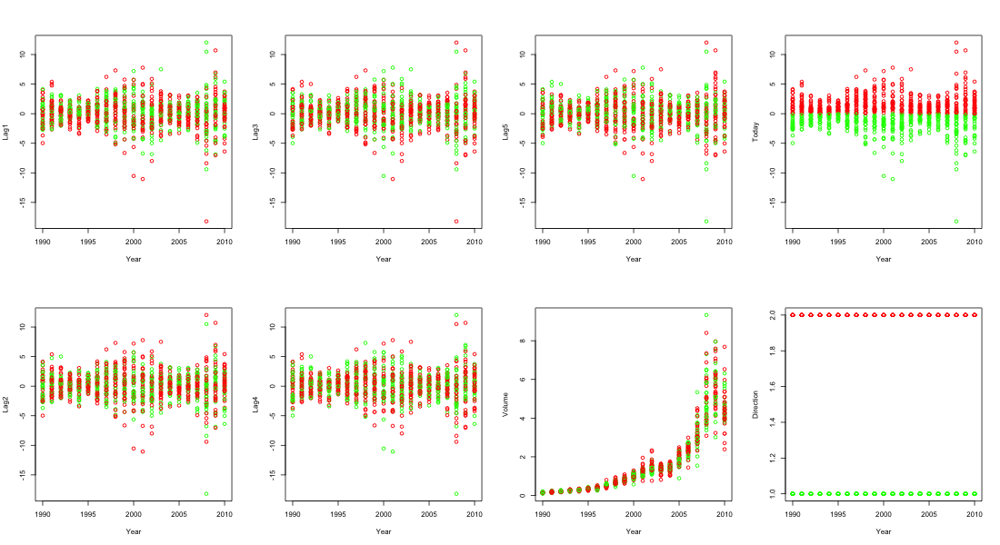

Homework 4
================
YutingMei
February 20, 2022

When the number of features p is large, there tends to be a
deterioration in the performance of KNN and other local approaches that
perform prediction using only observations that are near the test
observation for which a prediction must be made. This phenomenon is
known as the curse of dimensionality, and it ties into the fact that
non-parametric approaches often perform poorly when p is large. We will
now investigate this curse.

1.  Suppose that we have a set of observations, each with measurements
    on p = 1 feature, X. We assume that X is uniformly (evenly)
    distributed on \[0, 1\]. Associated with each observation is a
    response value. Suppose that we wish to predict a test observation’s
    response using only observations that are within 10 % of the range
    of X closest to that test observation. For instance, in order to
    predict the response for a test observation with X = 0.6, we will
    use observations in the range \[0.55,0.65\]. On average, what
    fraction of the available observations will we use to make the
    prediction?

-   Because X is uniformly (evenly) distributed on \[0, 1\], so it
    becomes a line. The fraction we use to make prediction is 0.1.

2.  Now suppose that we have a set of observations, each with
    measurements on p = 2 features, X1 and X2. We assume that (X1, X2)
    are uniformly distributed on \[0, 1\] × \[0, 1\]. We wish to predict
    a test observation’s response using only observations that are
    within 10 % of the range of X1 and within 10 % of the range of X2
    closest to that test observation. For instance, in order to predict
    the response for a test observation with X1 = 0.6 and X2 = 0.35, we
    will use observations in the range \[0.55, 0.65\] for X1 and in the
    range \[0.3,0.4\] for X2. On average, what fraction of the available
    observations will we use to make the prediction?

-   Since p equals to 2, then the space become a square, the fraction we
    need to predict about two ponts becomes 0.02.

3.  Now suppose that we have a set of observations on p = 100 fea-
    tures. Again the observations are uniformly distributed on each
    feature, and again each feature ranges in value from 0 to 1. We wish
    to predict a test observation’s response using observations within
    the 10 % of each feature’s range that is closest to that test
    observation. What fraction of the available observations will we use
    to make the prediction?

-   $( {10})^{100} $

4.  Using your answers to parts (a)–(c), argue that a drawback of KNN
    when p is large is that there are very few training observations
    “near” any given test observation.

-   When p is very large, the points closest to the predicted point will
    gradually become farther and farther as p increases, and finally
    most points will be very close to the edge of the cube. Calulating
    the k nearest distance become less meaningful.

5.  Now suppose that we wish to make a prediction for a test observation
    by creating a p-dimensional hypercube centered around the test
    observation that contains, on average, 10 % of the train- ing
    observations. For p = 1,2, and 100, what is the length of each side
    of the hypercube? Comment on your answer.

-   Suppose we have N points in total, when p = 1, the length of
    hypercube is 0.1, then p = 2, the length becomes $\\sqrt 0.1$, when
    p = 100, the length becomes $\\sqrt\[100\] 0.1$.

This question should be answered using the Weekly data set, which is
part of the ISLR2 package. This data is similar in nature to the Smarket
data from this chapter’s lab, except that it contains 1, 089 weekly
returns for 21 years, from the beginning of 1990 to the end of 2010.

1.  Produce some numerical and graphical summaries of the Weekly data.
    Do there appear to be any patterns?

``` r
summary(Weekly)
```

    ##       Year           Lag1               Lag2               Lag3         
    ##  Min.   :1990   Min.   :-18.1950   Min.   :-18.1950   Min.   :-18.1950  
    ##  1st Qu.:1995   1st Qu.: -1.1540   1st Qu.: -1.1540   1st Qu.: -1.1580  
    ##  Median :2000   Median :  0.2410   Median :  0.2410   Median :  0.2410  
    ##  Mean   :2000   Mean   :  0.1506   Mean   :  0.1511   Mean   :  0.1472  
    ##  3rd Qu.:2005   3rd Qu.:  1.4050   3rd Qu.:  1.4090   3rd Qu.:  1.4090  
    ##  Max.   :2010   Max.   : 12.0260   Max.   : 12.0260   Max.   : 12.0260  
    ##       Lag4               Lag5              Volume            Today         
    ##  Min.   :-18.1950   Min.   :-18.1950   Min.   :0.08747   Min.   :-18.1950  
    ##  1st Qu.: -1.1580   1st Qu.: -1.1660   1st Qu.:0.33202   1st Qu.: -1.1540  
    ##  Median :  0.2380   Median :  0.2340   Median :1.00268   Median :  0.2410  
    ##  Mean   :  0.1458   Mean   :  0.1399   Mean   :1.57462   Mean   :  0.1499  
    ##  3rd Qu.:  1.4090   3rd Qu.:  1.4050   3rd Qu.:2.05373   3rd Qu.:  1.4050  
    ##  Max.   : 12.0260   Max.   : 12.0260   Max.   :9.32821   Max.   : 12.0260  
    ##  Direction 
    ##  Down:484  
    ##  Up  :605  
    ##            
    ##            
    ##            
    ## 

    ## quartz_off_screen 
    ##                 2

``` r

```


2.  Use the full data set to perform a logistic regression with
    Direction as the response and the five lag variables plus Volume as
    predictors. Use the summary function to print the results. Do any of
    the predictors appear to be statistically significant? If so, which
    ones?

``` r
glm_fit <- glm(Direction ~ Lag1 + Lag2 + Lag3 + Lag4 + Lag5 + Volume, data = Weekly, family = binomial)
```

``` r
# I think no one appears to be statistically significant
glm_fit
```

    ## 
    ## Call:  glm(formula = Direction ~ Lag1 + Lag2 + Lag3 + Lag4 + Lag5 + 
    ##     Volume, family = binomial, data = Weekly)
    ## 
    ## Coefficients:
    ## (Intercept)         Lag1         Lag2         Lag3         Lag4         Lag5  
    ##     0.26686     -0.04127      0.05844     -0.01606     -0.02779     -0.01447  
    ##      Volume  
    ##    -0.02274  
    ## 
    ## Degrees of Freedom: 1088 Total (i.e. Null);  1082 Residual
    ## Null Deviance:       1496 
    ## Residual Deviance: 1486  AIC: 1500

3.  Compute the confusion matrix and overall fraction of correct
    predictions. Explain what the confusion matrix is telling you about
    the types of mistakes made by logistic regression.

``` r
glm_probs <- predict(glm_fit,type = "response")
```

``` r
glm_pred <- ifelse(glm_probs > 0.5, "Up", "Down")
```

``` r
# Sensitivity(TPR) = TP/(TP + FN) is low, means that the probability of Down being predicted correct is low
# Specificity(TNR) = SPC = TN/N = TN/(FP + TN) is high, vice versa
# pos pred value(PPV) = TP / (TP + FP) doesn't have big difference between neg pred value(NPV) = TN / (TN + FN), which means that the probability of the model misclassifying down and up is about the same
# the model seems not good
confusionMatrix(data = glm_pred %>% as.factor(), reference = Weekly$Direction %>% as.factor())
```

    ## Confusion Matrix and Statistics
    ## 
    ##           Reference
    ## Prediction Down  Up
    ##       Down   54  48
    ##       Up    430 557
    ##                                          
    ##                Accuracy : 0.5611         
    ##                  95% CI : (0.531, 0.5908)
    ##     No Information Rate : 0.5556         
    ##     P-Value [Acc > NIR] : 0.369          
    ##                                          
    ##                   Kappa : 0.035          
    ##                                          
    ##  Mcnemar's Test P-Value : <2e-16         
    ##                                          
    ##             Sensitivity : 0.11157        
    ##             Specificity : 0.92066        
    ##          Pos Pred Value : 0.52941        
    ##          Neg Pred Value : 0.56434        
    ##              Prevalence : 0.44444        
    ##          Detection Rate : 0.04959        
    ##    Detection Prevalence : 0.09366        
    ##       Balanced Accuracy : 0.51612        
    ##                                          
    ##        'Positive' Class : Down           
    ## 

4.  Now fit the logistic regression model using a training data period
    from 1990 to 2008, with Lag2 as the only predictor. Compute the
    confusion matrix and the overall fraction of correct predictions for
    the held out data (that is, the data from 2009 and 2010).

``` r
pk_y = filter(Weekly, Year %in% seq(1990, 2008))
pt_y = filter(Weekly, Year %in% seq(2009, 2010))
glm_fit2 <- glm(Direction ~ Lag2, data = pk_y, family = binomial)
glm_probs2 <- predict(glm_fit2,newdata = pt_y, type = "response")
glm_pred2 <- ifelse(glm_probs2 > 0.5, "Up", "Down")
```

``` r
# Sensitivity, ppv and npv become better
ry = Weekly %>% filter(Year %in% seq(2009, 2010))
confusionMatrix(data = glm_pred2 %>% as.factor(), reference = ry$Direction %>% as.factor())
```

    ## Confusion Matrix and Statistics
    ## 
    ##           Reference
    ## Prediction Down Up
    ##       Down    9  5
    ##       Up     34 56
    ##                                          
    ##                Accuracy : 0.625          
    ##                  95% CI : (0.5247, 0.718)
    ##     No Information Rate : 0.5865         
    ##     P-Value [Acc > NIR] : 0.2439         
    ##                                          
    ##                   Kappa : 0.1414         
    ##                                          
    ##  Mcnemar's Test P-Value : 7.34e-06       
    ##                                          
    ##             Sensitivity : 0.20930        
    ##             Specificity : 0.91803        
    ##          Pos Pred Value : 0.64286        
    ##          Neg Pred Value : 0.62222        
    ##              Prevalence : 0.41346        
    ##          Detection Rate : 0.08654        
    ##    Detection Prevalence : 0.13462        
    ##       Balanced Accuracy : 0.56367        
    ##                                          
    ##        'Positive' Class : Down           
    ## 

5.  Repeat (d) using LDA.

``` r
model_p = function(mdl){
  if (as.character(substitute(mdl)) == 'lda' | as.character(substitute(mdl)) == 'qda'){
    fit = mdl(Direction ~ Lag2, data = pk_y)
    probs <- predict(fit,newdata = pt_y)
    pred = probs$class
  }
  else
    if (as.character(substitute(mdl)) == 'knn'){
      pred = knn(train = pk_y[,"Lag2", drop = F], test = ry[,"Lag2", drop = F], cl = pk_y$Direction, k=1)
    }
  else{
    fit = naiveBayes(Direction ~ Lag2, data = pk_y)
    pred = predict(fit,newdata = pt_y)
  }
  confusionMatrix(data = pred %>% as.factor(), reference = ry$Direction %>% as.factor())
}
```

``` r
model_p(lda)
```

    ## Confusion Matrix and Statistics
    ## 
    ##           Reference
    ## Prediction Down Up
    ##       Down    9  5
    ##       Up     34 56
    ##                                          
    ##                Accuracy : 0.625          
    ##                  95% CI : (0.5247, 0.718)
    ##     No Information Rate : 0.5865         
    ##     P-Value [Acc > NIR] : 0.2439         
    ##                                          
    ##                   Kappa : 0.1414         
    ##                                          
    ##  Mcnemar's Test P-Value : 7.34e-06       
    ##                                          
    ##             Sensitivity : 0.20930        
    ##             Specificity : 0.91803        
    ##          Pos Pred Value : 0.64286        
    ##          Neg Pred Value : 0.62222        
    ##              Prevalence : 0.41346        
    ##          Detection Rate : 0.08654        
    ##    Detection Prevalence : 0.13462        
    ##       Balanced Accuracy : 0.56367        
    ##                                          
    ##        'Positive' Class : Down           
    ## 

6.  Repeat (d) using QDA.

``` r
model_p(qda)
```

    ## Confusion Matrix and Statistics
    ## 
    ##           Reference
    ## Prediction Down Up
    ##       Down    0  0
    ##       Up     43 61
    ##                                           
    ##                Accuracy : 0.5865          
    ##                  95% CI : (0.4858, 0.6823)
    ##     No Information Rate : 0.5865          
    ##     P-Value [Acc > NIR] : 0.5419          
    ##                                           
    ##                   Kappa : 0               
    ##                                           
    ##  Mcnemar's Test P-Value : 1.504e-10       
    ##                                           
    ##             Sensitivity : 0.0000          
    ##             Specificity : 1.0000          
    ##          Pos Pred Value :    NaN          
    ##          Neg Pred Value : 0.5865          
    ##              Prevalence : 0.4135          
    ##          Detection Rate : 0.0000          
    ##    Detection Prevalence : 0.0000          
    ##       Balanced Accuracy : 0.5000          
    ##                                           
    ##        'Positive' Class : Down            
    ## 

7.  Repeat (d) using KNN with K = 1.

``` r
model_p(knn)
```

    ## Confusion Matrix and Statistics
    ## 
    ##           Reference
    ## Prediction Down Up
    ##       Down   21 29
    ##       Up     22 32
    ##                                          
    ##                Accuracy : 0.5096         
    ##                  95% CI : (0.4097, 0.609)
    ##     No Information Rate : 0.5865         
    ##     P-Value [Acc > NIR] : 0.9540         
    ##                                          
    ##                   Kappa : 0.0127         
    ##                                          
    ##  Mcnemar's Test P-Value : 0.4008         
    ##                                          
    ##             Sensitivity : 0.4884         
    ##             Specificity : 0.5246         
    ##          Pos Pred Value : 0.4200         
    ##          Neg Pred Value : 0.5926         
    ##              Prevalence : 0.4135         
    ##          Detection Rate : 0.2019         
    ##    Detection Prevalence : 0.4808         
    ##       Balanced Accuracy : 0.5065         
    ##                                          
    ##        'Positive' Class : Down           
    ## 

8.  Repeat (d) using naive Bayes.

``` r
model_p(naiveBayes)
```

    ## Confusion Matrix and Statistics
    ## 
    ##           Reference
    ## Prediction Down Up
    ##       Down    0  0
    ##       Up     43 61
    ##                                           
    ##                Accuracy : 0.5865          
    ##                  95% CI : (0.4858, 0.6823)
    ##     No Information Rate : 0.5865          
    ##     P-Value [Acc > NIR] : 0.5419          
    ##                                           
    ##                   Kappa : 0               
    ##                                           
    ##  Mcnemar's Test P-Value : 1.504e-10       
    ##                                           
    ##             Sensitivity : 0.0000          
    ##             Specificity : 1.0000          
    ##          Pos Pred Value :    NaN          
    ##          Neg Pred Value : 0.5865          
    ##              Prevalence : 0.4135          
    ##          Detection Rate : 0.0000          
    ##    Detection Prevalence : 0.0000          
    ##       Balanced Accuracy : 0.5000          
    ##                                           
    ##        'Positive' Class : Down            
    ## 

1.  Which of these methods appears to provide the best results on this
    data?

-   LDA performs best

10. Experiment with different combinations of predictors, including
    possible transformations and interactions, for each of the methods.
    Report the variables, method, and associated confusion matrix that
    appears to provide the best results on the held out data. Note that
    you should also experiment with values for K in the KNN classifier.

``` r
model_px = function(mdl, k, y_, ...){
  f = as.formula(paste(y_,
                     paste(..., collapse = '+'), 
                     sep = '~'))
  if (as.character(substitute(mdl)) == 'lda' | as.character(substitute(mdl)) == 'qda'){
    fit = mdl(f, data = pk_y)
    probs <- predict(fit,newdata = pt_y)
    pred = probs$class
  }
  else
    if (as.character(substitute(mdl)) == 'knn'){
      pred = knn(train = pk_y[,"Lag2", drop = F], test = ry[,"Lag2", drop = F], cl = pk_y$Direction, k=k)
    }
  else{
    fit = naiveBayes(f, data = pk_y)
    pred = predict(fit,newdata = pt_y)
  }
  confusionMatrix(data = pred %>% as.factor(), reference = ry$Direction %>% as.factor())
}
```

``` r
model_px(lda, k = 0, y_ = 'Direction', c('Lag1* Lag2', 'Lag3', 'Lag4 ^ 2'))
```

    ## Confusion Matrix and Statistics
    ## 
    ##           Reference
    ## Prediction Down Up
    ##       Down    5  8
    ##       Up     38 53
    ##                                         
    ##                Accuracy : 0.5577        
    ##                  95% CI : (0.457, 0.655)
    ##     No Information Rate : 0.5865        
    ##     P-Value [Acc > NIR] : 0.7579        
    ##                                         
    ##                   Kappa : -0.0166       
    ##                                         
    ##  Mcnemar's Test P-Value : 1.904e-05     
    ##                                         
    ##             Sensitivity : 0.11628       
    ##             Specificity : 0.86885       
    ##          Pos Pred Value : 0.38462       
    ##          Neg Pred Value : 0.58242       
    ##              Prevalence : 0.41346       
    ##          Detection Rate : 0.04808       
    ##    Detection Prevalence : 0.12500       
    ##       Balanced Accuracy : 0.49257       
    ##                                         
    ##        'Positive' Class : Down          
    ## 

``` r
model_px(qda, k = 0, y_ = 'Direction', c('Lag1* Lag2', 'exp(Lag5)'))
```

    ## Confusion Matrix and Statistics
    ## 
    ##           Reference
    ## Prediction Down Up
    ##       Down   37 53
    ##       Up      6  8
    ##                                           
    ##                Accuracy : 0.4327          
    ##                  95% CI : (0.3359, 0.5335)
    ##     No Information Rate : 0.5865          
    ##     P-Value [Acc > NIR] : 0.9994          
    ##                                           
    ##                   Kappa : -0.0072         
    ##                                           
    ##  Mcnemar's Test P-Value : 2.115e-09       
    ##                                           
    ##             Sensitivity : 0.8605          
    ##             Specificity : 0.1311          
    ##          Pos Pred Value : 0.4111          
    ##          Neg Pred Value : 0.5714          
    ##              Prevalence : 0.4135          
    ##          Detection Rate : 0.3558          
    ##    Detection Prevalence : 0.8654          
    ##       Balanced Accuracy : 0.4958          
    ##                                           
    ##        'Positive' Class : Down            
    ## 

``` r
model_px(knn, k = 4, y_ = 'Direction', c('Lag2* Lag6', 'Lag3'))
```

    ## Confusion Matrix and Statistics
    ## 
    ##           Reference
    ## Prediction Down Up
    ##       Down   17 24
    ##       Up     26 37
    ##                                           
    ##                Accuracy : 0.5192          
    ##                  95% CI : (0.4191, 0.6183)
    ##     No Information Rate : 0.5865          
    ##     P-Value [Acc > NIR] : 0.9316          
    ##                                           
    ##                   Kappa : 0.0019          
    ##                                           
    ##  Mcnemar's Test P-Value : 0.8875          
    ##                                           
    ##             Sensitivity : 0.3953          
    ##             Specificity : 0.6066          
    ##          Pos Pred Value : 0.4146          
    ##          Neg Pred Value : 0.5873          
    ##              Prevalence : 0.4135          
    ##          Detection Rate : 0.1635          
    ##    Detection Prevalence : 0.3942          
    ##       Balanced Accuracy : 0.5010          
    ##                                           
    ##        'Positive' Class : Down            
    ## 

``` r
model_px(naiveBayes, k = 0, y_ = 'Direction', c('Lag2 ^2', 'Lag4'))
```

    ## Confusion Matrix and Statistics
    ## 
    ##           Reference
    ## Prediction Down Up
    ##       Down    7 12
    ##       Up     36 49
    ##                                          
    ##                Accuracy : 0.5385         
    ##                  95% CI : (0.438, 0.6367)
    ##     No Information Rate : 0.5865         
    ##     P-Value [Acc > NIR] : 0.8630793      
    ##                                          
    ##                   Kappa : -0.037         
    ##                                          
    ##  Mcnemar's Test P-Value : 0.0009009      
    ##                                          
    ##             Sensitivity : 0.16279        
    ##             Specificity : 0.80328        
    ##          Pos Pred Value : 0.36842        
    ##          Neg Pred Value : 0.57647        
    ##              Prevalence : 0.41346        
    ##          Detection Rate : 0.06731        
    ##    Detection Prevalence : 0.18269        
    ##       Balanced Accuracy : 0.48303        
    ##                                          
    ##        'Positive' Class : Down           
    ## 
