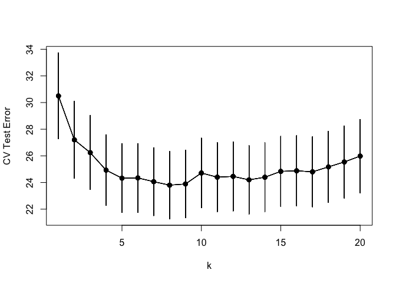

Homework 5
================
YutingMei
March 04, 2022

``` r
library('MASS') ## for 'mcycle'
library('dplyr')
```

    ## 
    ## Attaching package: 'dplyr'

    ## The following object is masked from 'package:MASS':
    ## 
    ##     select

    ## The following objects are masked from 'package:stats':
    ## 
    ##     filter, lag

    ## The following objects are masked from 'package:base':
    ## 
    ##     intersect, setdiff, setequal, union

``` r
library('manipulate') ## for 'manipulate'
library(rlang)
library(caret)
```

    ## Loading required package: ggplot2

    ## Loading required package: lattice

-   Randomly split the mcycle data into training (75%) and validation
    (25%) subsets.

``` r
y <- mcycle$accel
x <- matrix(mcycle$times, length(mcycle$times), 1)
```

``` r
plot(x, y, xlab="Time (ms)", ylab="Acceleration (g)")
```

<!-- -->

``` r
dt = cbind(x,y)
```

``` r
train_index = sample.int(nrow(dt), nrow(dt) * .75, replace = F)
index_list = seq(nrow(dt))
valid_index = index_list[!index_list %in% train_index]
train = dt[train_index, ]
valid = dt[valid_index, ]
```

-   Using the mcycle data, consider predicting the mean acceleration as
    a function of time. Use the Nadaraya-Watson method with the k-NN
    kernel function to create a series of prediction models by varying
    the tuning parameter over a sequence of values. (hint: the script
    already implements this)

``` r
## k-NN kernel function
## x  - n x p matrix of training inputs
## x0 - 1 x p input where to make prediction
## k  - number of nearest neighbors
kernel_k_nearest_neighbors <- function(x, x0, k) {
  ## compute distance betwen each x and x0
  z <- t(t(x) - x0)
  d <- sqrt(rowSums(z*z))

  ## initialize kernel weights to zero
  w <- rep(0, length(d))
  
  ## set weight to 1 for k nearest neighbors
  w[order(d)[1:k]] <- 1
  
  return(w)
}
```

``` r
## Make predictions using the NW method
## y  - n x 1 vector of training outputs
## x  - n x p matrix of training inputs
## x0 - m x p matrix where to make predictions
## kern  - kernel function to use
## ... - arguments to pass to kernel function
nadaraya_watson <- function(y, x, x0, kern, ...) {
  k <- t(apply(x0, 1, function(x0_) {
    k_ <- kern(x, x0_, ...)
    k_/sum(k_)
  }))
  yhat <- drop(k %*% y)
  attr(yhat, 'k') <- k
  return(yhat)
}
```

``` r
## Compute effective df using NW method
## y  - n x 1 vector of training outputs
## x  - n x p matrix of training inputs
## kern  - kernel function to use
## ... - arguments to pass to kernel function
effective_df <- function(y, x, kern, ...) {
  y_hat <- nadaraya_watson(y, x, x,
    kern=kern, ...)
  sum(diag(attr(y_hat, 'k')))
}
```

``` r
## loss function
## y    - train/test y
## yhat - predictions at train/test x
loss_squared_error <- function(y, yhat)
  (y - yhat)^2

## test/train error
## y    - train/test y
## yhat - predictions at train/test x
## loss - loss function
error <- function(y, yhat, loss=loss_squared_error)
  mean(loss(y, yhat))

## AIC
## y    - training y
## yhat - predictions at training x
## d    - effective degrees of freedom
aic <- function(y, yhat, d)
  error(y, yhat) + 2/length(y)*d

## BIC
## y    - training y
## yhat - predictions at training x
## d    - effective degrees of freedom
bic <- function(y, yhat, d)
  error(y, yhat) + log(length(y))/length(y)*d
```

``` r
options(warn=-1)
## how does k affect shape of predictor and eff. df using k-nn kernel ?
# manipulate({
#   ## make predictions using NW method at training inputs
#   y_hat <- nadaraya_watson(y, x, x,
#     kern=kernel_k_nearest_neighbors, k=k_slider)
#   edf <- effective_df(y, x,
#     kern=kernel_k_nearest_neighbors, k=k_slider)
#   aic_ <- aic(y, y_hat, edf)
#   bic_ <- bic(y, y_hat, edf)
#   y_hat_plot <- nadaraya_watson(y, x, x_plot,
#     kern=kernel_k_nearest_neighbors, k=k_slider)
#   plot(x, y, xlab="Time (ms)", ylab="Acceleration (g)")
#   legend('topright', legend = c(
#     paste0('eff. df = ', round(edf,1)),
#     paste0('aic = ', round(aic_, 1)),
#     paste0('bic = ', round(bic_, 1))),
#     bty='n')
#   lines(x_plot, y_hat_plot, col="#882255", lwd=2)
# }, k_slider=slider(1, 15, initial=3, step=1))
```

-   With the squared-error loss function, compute and plot the training
    error, AIC, BIC, and validation error (using the validation data) as
    functions of the tuning parameter.

``` r
error_combine = function(k_seq, y, x){
  y = matrix(y)
  x = matrix(x)
  aic_ = c()
  bic_ = c()
  error_ = c()
  for (i in k_seq){
  y_hat <- nadaraya_watson(y, x, x,
    kern=kernel_k_nearest_neighbors, k=i)
  edf <- effective_df(y, x,
    kern=kernel_k_nearest_neighbors, k=i)
  error_ = append(error_, error(y, y_hat))
  aic_ <- append(aic_, aic(y, y_hat, edf))
  bic_ <- append(bic_, bic(y, y_hat, edf))
  }
  data.frame(k = k_seq, aic = aic_, bic = bic_, error = error_)
}
```

``` r
# train error
error_combine(seq(1,20), train[,2], train[,1])
```

    ##     k      aic      bic    error
    ## 1   1 287.9006 289.8404 286.4057
    ## 2   2 270.6587 271.8777 269.7193
    ## 3   3 404.1251 404.9726 403.4719
    ## 4   4 420.2576 420.8999 419.7627
    ## 5   5 453.4305 453.9496 453.0305
    ## 6   6 483.1083 483.5408 482.7749
    ## 7   7 486.2737 486.6444 485.9880
    ## 8   8 481.1078 481.4322 480.8578
    ## 9   9 505.7920 506.0804 505.5698
    ## 10 10 521.5788 521.8383 521.3788
    ## 11 11 543.6429 543.8789 543.4611
    ## 12 12 550.3055 550.5217 550.1388
    ## 13 13 558.0568 558.2564 557.9029
    ## 14 14 563.7776 563.9629 563.6347
    ## 15 15 590.0135 590.1866 589.8802
    ## 16 16 598.0731 598.2353 597.9481
    ## 17 17 614.3438 614.4965 614.2262
    ## 18 18 653.4116 653.5557 653.3005
    ## 19 19 684.6484 684.7850 684.5432
    ## 20 20 696.8406 696.9703 696.7406

``` r
# test error
error_combine(seq(1,20), valid[,2], valid[,1])
```

    ##     k        aic        bic      error
    ## 1   1   36.60529   38.04187   34.72294
    ## 2   2  172.41088  173.17406  171.41088
    ## 3   3  278.87918  279.38797  278.21252
    ## 4   4  405.80445  406.18604  405.30445
    ## 5   5  487.60153  487.90680  487.20153
    ## 6   6  481.23537  481.48976  480.90203
    ## 7   7  513.86352  514.08157  513.57780
    ## 8   8  635.65836  635.84915  635.40836
    ## 9   9  782.95341  783.12301  782.73119
    ## 10 10  817.46686  817.61950  817.26686
    ## 11 11  973.53919  973.67795  973.35737
    ## 12 12 1110.57754 1110.70473 1110.41087
    ## 13 13 1209.35328 1209.47069 1209.19943
    ## 14 14 1384.56410 1384.67312 1384.42124
    ## 15 15 1572.09933 1572.20109 1571.96600
    ## 16 16 1708.89046 1708.98586 1708.76546
    ## 17 17 1821.54371 1821.63350 1821.42606
    ## 18 18 1932.96724 1933.05204 1932.85613
    ## 19 19 2055.52273 2055.60307 2055.41747
    ## 20 20 2157.24321 2157.31953 2157.14321

-   For each value of the tuning parameter, Perform 5-fold
    cross-validation using the combined training and validation data.
    This results in 5 estimates of test error per tuning parameter
    value.

``` r
train.control <- trainControl(method = "cv", number = 5)
train_error_cv = train(y ~ .,
      method = 'knn',
      tuneGrid = expand.grid(k = 1:20),
      trControl = train.control,
      data = rbind(train, valid) %>% data.frame())
train_error_cv
```

    ## k-Nearest Neighbors 
    ## 
    ## 133 samples
    ##   1 predictor
    ## 
    ## No pre-processing
    ## Resampling: Cross-Validated (5 fold) 
    ## Summary of sample sizes: 107, 106, 107, 106, 106 
    ## Resampling results across tuning parameters:
    ## 
    ##   k   RMSE      Rsquared   MAE     
    ##    1  30.49649  0.6433922  21.82551
    ##    2  27.20424  0.7090792  19.17069
    ##    3  26.24201  0.7244308  18.58948
    ##    4  24.92729  0.7362314  18.41287
    ##    5  24.32550  0.7540438  18.44721
    ##    6  24.34457  0.7525975  18.04246
    ##    7  24.06292  0.7577488  17.91607
    ##    8  23.80112  0.7652275  17.61442
    ##    9  23.89033  0.7676794  17.80498
    ##   10  24.71438  0.7558739  18.57435
    ##   11  24.40131  0.7619546  18.29725
    ##   12  24.45767  0.7616317  18.33464
    ##   13  24.20034  0.7689763  18.22503
    ##   14  24.39667  0.7662070  18.45607
    ##   15  24.83483  0.7573771  18.63689
    ##   16  24.87979  0.7559232  18.90637
    ##   17  24.80163  0.7667610  19.03646
    ##   18  25.17186  0.7596553  19.57276
    ##   19  25.54135  0.7555741  19.88360
    ##   20  25.98345  0.7480410  20.20414
    ## 
    ## RMSE was used to select the optimal model using the smallest value.
    ## The final value used for the model was k = 8.

-   Plot the CV-estimated test error (average of the five estimates from
    each fold) as a function of the tuning parameter. Add vertical line
    segments to the figure (using the segments function in R) that
    represent one “standard error” of the CV-estimated test error
    (standard deviation of the five estimates from each fold).

``` r
cv_all = train_error_cv$results %>%
  mutate(rmse_low = RMSE - 2*(RMSE / sqrt(train_error_cv$control$number)),
         rmse_high = RMSE - 2*(RMSE / sqrt(train_error_cv$control$number)))
```

``` r
plot(x=range(as.matrix((cv_all$k))),
     y=range(range(cv_all$RMSE - cv_all$rmse_low, cv_all$RMSE + cv_all$rmse_high)),
     type='n',
     xlab='k',
     ylab='CV Test Error')
for(i in 1:nrow(cv_all)) {
  points(x=cv_all$k, y=cv_all$RMSE, pch=19, col='#00000055')
  lines(x=cv_all$k, y=cv_all$RMSE, col='#00000055')
  segments(x0 = cv_all$k, y0 = cv_all$RMSE - cv_all$rmse_low, x1 = cv_all$k, y1 = cv_all$rmse_high + cv_all$RMSE)
}
```

<!-- -->

-   Interpret the resulting figures and select a suitable value for the
    tuning parameter.
-   When the k increases, the error become smaller for k from 1 to 15,
    but when k stil increases, the test error become greater again. k =
    3 or 4 is suitable by one-standard-error rule.
